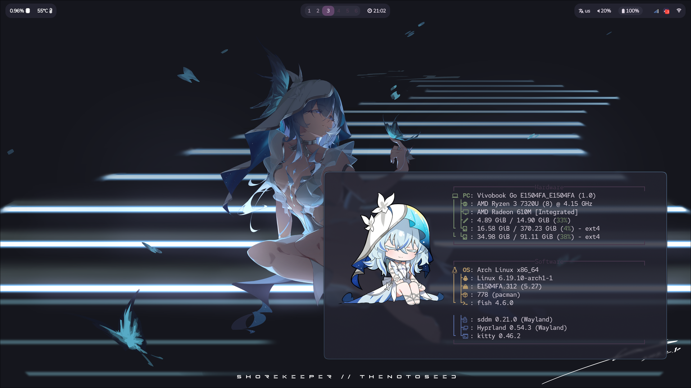

#  Shorekeeper dotfiles

A minimal [Hyprland](https://hyprland.org/) configuration for Arch Linux. 



---

###  Features
- Hyprland (Wayland)
- Quickshell bar, theme switcher and app launcher
- Waybar
- Kitty
- Wlogout
- Shorekeeper wallpapers

###  Installation

```bash
git clone https://github.com/Cenaure/dotfiles.git
cd dotfiles
./install.sh -p
```

`install.sh` symlinks every directory under `.config/` into `~/.config`, so this
repository stays the only copy of them: edit a config here and the change is
live. The script prints what it is about to do and waits for confirmation before
touching anything.

| Command | |
|---|---|
| `./install.sh` | Link every config |
| `./install.sh -p` | Install the packages they need, first |
| `./install.sh -n` | Print the plan and exit |
| `./install.sh quickshell` | Relink a single config |
| `./install.sh --help` | Every option |

Run it again whenever you want to replace an older install: anything sitting in
the way is moved to `~/.config-backup/<timestamp>/` before the new links go in.
