#  Cenaure dotfiles

A small cozy [Hyprland](https://hyprland.org/) and quickshell configuration for Arch Linux. With two themes: girls last tour and shorekeeper. You can easily add any theme you want by editing theme configs.

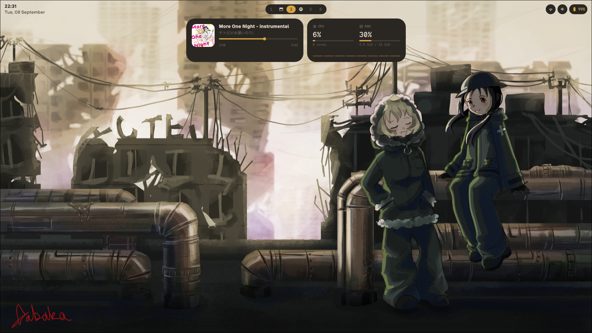

---

### Features

- Hyprland
- Quickshell
- Kitty

Quickshell Widgets:

<details>
<summary>Bar (date, workspaces, tray, network, sound, battery)</summary>


</details>

<details>
<summary>Desktop screen (media and system resources usage)</summary>

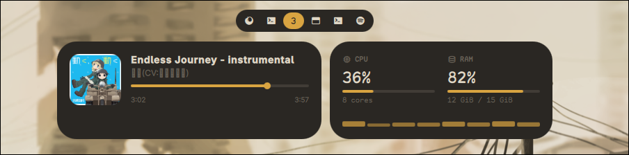

</details>

<details>
<summary>App Launcher (clipboard history, calculator)</summary>

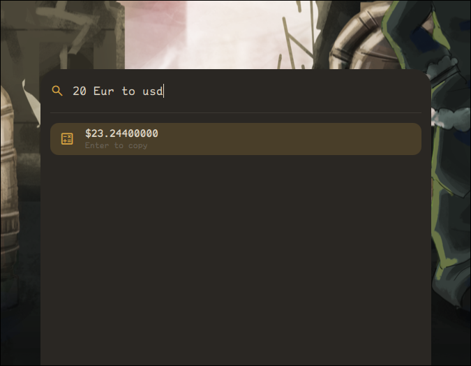
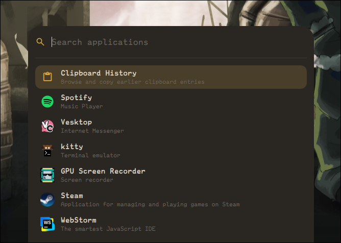

</details>

<details>
<summary>Notifications</summary>

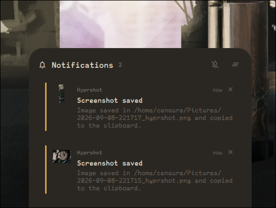

</details>

<details>
<summary>Popups</summary>

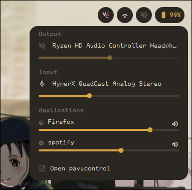
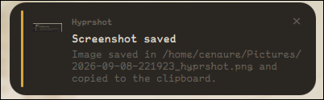

</details>

<details>
<summary>Power menu</summary>

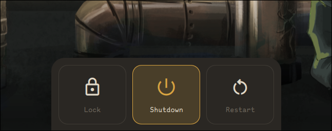

</details>

<details>
<summary>Themes!</summary>

Shorekeeper theme:
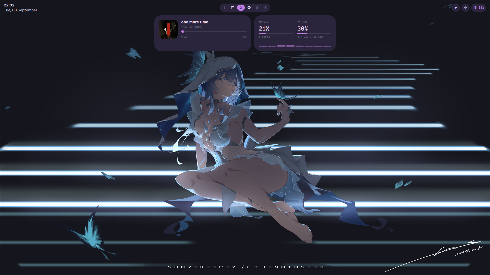
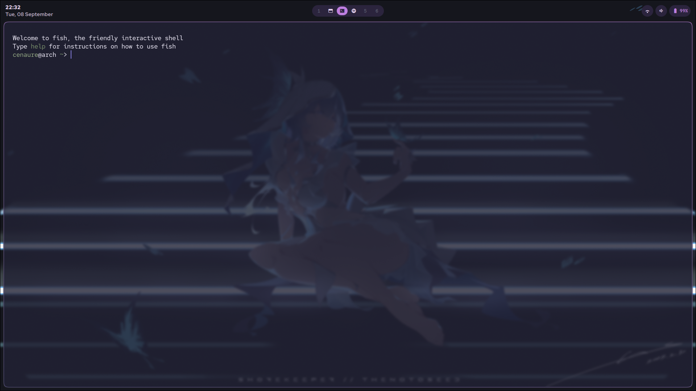

Girls Last Tour theme:

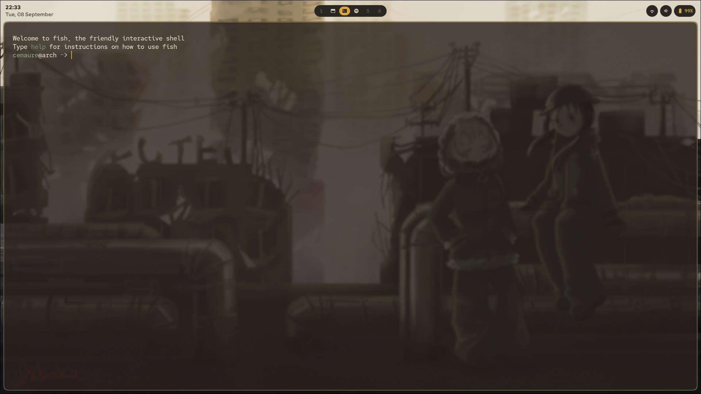

</details>

###  Installation

```bash
git clone https://github.com/Cenaure/dotfiles.git
cd dotfiles
./install.sh -p
```

`install.sh` symlinks every directory under `.config/` into `~/.config`, so this
repository stays the only copy of them: edit a config here and the change is
live. The script prints what it is about to do and waits for confirmation before
touching anything.

| Command                   |                                       |
| ------------------------- | ------------------------------------- |
| `./install.sh`            | Link every config                     |
| `./install.sh -p`         | Install the packages they need, first |
| `./install.sh -n`         | Print the plan and exit               |
| `./install.sh quickshell` | Relink a single config                |
| `./install.sh --help`     | Every option                          |

Run it again whenever you want to replace an older install: anything sitting in
the way is moved to `~/.config-backup/<timestamp>/` before the new links go in.